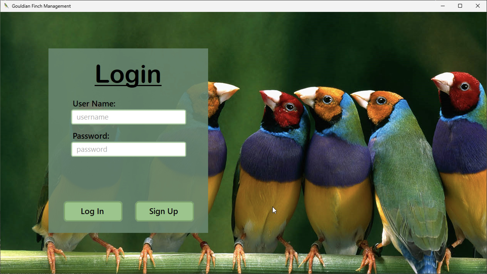
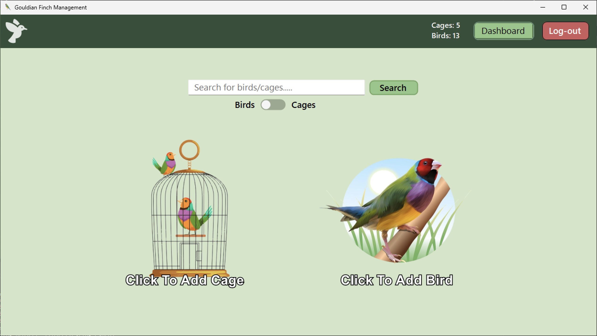
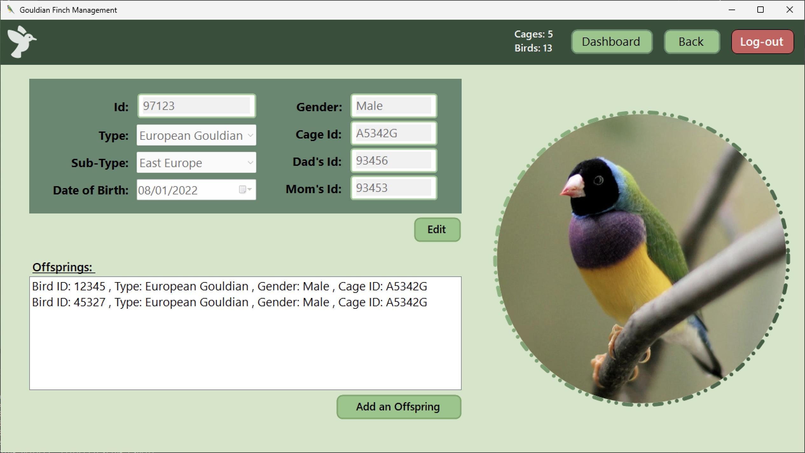

# Bird Habitat Management App

This repository contains the code for a Bird Habitat Management App. The app allows users to create an account, manage cages, birds, and their offspring. It provides a convenient way to organize and track bird habitats and populations.

## Features

- **User Authentication:** Users can create an account and log in to access their personalized bird habitat management dashboard.
- **Cage Management:** Users can add and manage cages within their account. Each cage represents a specific habitat for birds.
- **Bird Management:** Users can add birds to their cages, providing details such as species, age, and gender. They can also update birds as needed.
- **Offspring Management:** Users can track the breeding of birds by adding offspring to parent birds. This feature helps monitor the population dynamics of the bird habitats.

## Installation

To use this Bird Habitat Management App locally, follow these steps:

1. Clone the repository:

```shell
git clone https://github.com/Shayhha/ProjectTesting.git
```

2. Open the project in your preferred C# integrated development environment (IDE), such as Visual Studio.
3. Build the solution to compile the application.
4. Run the application within your IDE or by executing the compiled binary.
5. The Bird Habitat Management App will launch, and you can start using it through the graphical user interface.

## Screenshots

Here are some screenshots of the Bird Habitat Management App:


*Login page*


*Home page*


*Additional information page*

## Acknowledgements

We would like to thank the contributors who have helped develop and improve this project, as well
as RJCodeAdvance(https://github.com/RJCodeAdvance/RJControls) for creating modern, flat, and elegant Custom Controls for Windows Forms and allowing people to use
them for learning purposes.

## Contact

If you have any questions, suggestions, or feedback, please feel free to reach out to us:

- Developer: Maxim Subotin
- GitHub: [MaxSubotin](https://github.com/MaxSubotin)

- Deceloper: Shay Hahiashvili 
- GitHub: [Shayhha](https://github.com/Shayhha)
- Project Repository: [https://github.com/Shayhha/ProjectTesting](https://github.com/Shayhha/ProjectTesting)

